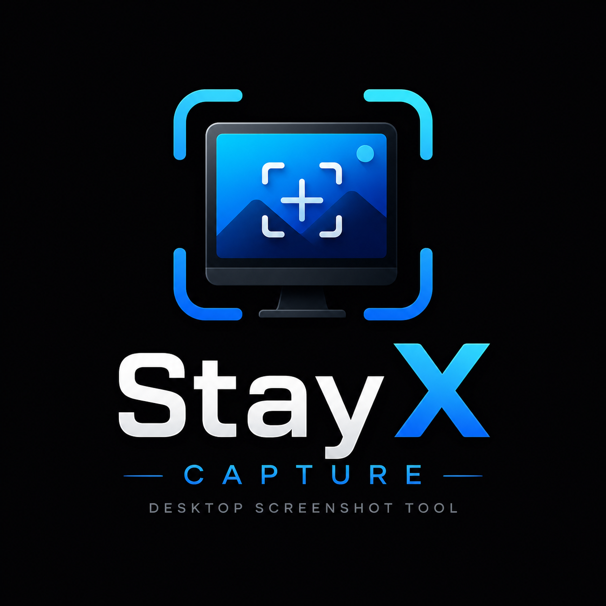

# 📸 StayX Capture

[](LICENSE)
[](https://www.python.org/)
[](#system-requirements)
[](CONTRIBUTING.md)

A beautiful, minimalistic, and feature-rich screenshot utility for Windows with a premium dark-themed interface, system tray integration, built-in annotation editor, history tracker, and instant cloud/custom API upload options.



---

## 📖 Table of Contents
* [✨ Features](#-features)
* [🚀 Quick Start (Windows)](#-quick-start-windows)
* [📦 Installation (Development)](#-installation-development)
* [⚙️ Configuration & Storage](#️-configuration--storage)
* [📡 API Server Integration](#-api-server-integration)
* [🛠️ Building Standalone Executable (.exe)](#️-building-standalone-executable-exe)
* [🤝 Contributing](#-contributing)
* [⚖️ License](#️-license)

---

## ✨ Features

* 🎨 **Premium Modern Design**: A glassmorphic dark-themed PyQt5 GUI with smooth animations, tabs, and layout transitions.
* 📸 **Capture Modes**:
  * **Region Capture**: Click and drag to capture any custom region with a live zoom preview, dimension indicators, and crosshair.
  * **Fullscreen Capture**: Grab all monitors instantly with a single click.
* ✏️ **Built-in Annotation Editor**: Modify screenshots before saving:
  * Draw with a pen, highlighter, or add custom rectangles, arrows, and texts.
  * Add blur to mask sensitive details.
  * Undo / Redo support and image cropping.
* ☁️ **Cloud & Cloud Storage Integrations**:
  * **ImgBB Integration**: Upload images directly to ImgBB and copy the link.
  * **Google Drive**: Save screenshots directly to your Google Drive account.
  * **Custom API Upload**: Send screenshots and clipboard text to your own backend server (see [API_SERVER_EXAMPLES.md](API_SERVER_EXAMPLES.md)).
* 🔔 **Smart Tray Integration**: Minimizes to system tray for unobtrusive running. Access quick capture actions, toggle autostart, and settings directly via the right-click context menu.
* 📋 **Clipboard History & Monitor**: Automatically monitors and maintains a history of copied text, allowing you to back it up or sync it to your custom API server.
* ⌨️ **Global Keyboard Hotkeys**: Trigger captures globally at any time using system-wide hotkeys (e.g., `Ctrl + Shift + 1`).

---

## 🚀 Quick Start (Windows)

If you are on Windows and just want to run the application immediately, follow these simple steps:

1. **First-Time Setup**:
   * Double-click **`setup.bat`** in the project folder.
   * This script will verify Python, create a local virtual environment (`venv`), and install all dependencies.
   * Wait for it to complete, then press any key.

2. **Launch the App**:
   * Double-click **`run.bat`** (or execute `python Capture.py` in your shell) to launch the application.

3. **How to Use**:
   * Click **🎯 Capture Screen Region** to drag-select an area (Press `ESC` to cancel).
   * Click **📺 Capture Full Screen** for a fullscreen capture.
   * Click **⚙️ Settings** to modify your save folder, configure global hotkeys, or set up API upload tokens.
   * Close the main window to minimize the app to the system tray. Right-click the tray icon to exit completely.

---

## 📦 Installation (Development)

To set up a manual development environment and inspect/modify the source code:

### Prerequisites
* Windows 10 or 11
* Python 3.8 or higher installed on your system (ensure it is added to your system `PATH`)

### Development Environment Setup

1. **Clone the Repository**:
   ```bash
   git clone https://github.com/yourusername/StayXCapture.git
   cd "StayX Capture"
   ```

2. **Create and Activate Virtual Environment**:
   ```bash
   python -m venv venv
   venv\Scripts\activate
   ```

3. **Install Dependencies**:
   ```bash
   pip install -r requirements.txt
   ```

4. **Run the Application**:
   ```bash
   python Capture.py
   ```

---

## ⚙️ Configuration & Storage

StayX Capture stores configurations and database files locally in the user's Home directory (`~`) to ensure clean workspace directories:

* **Configuration Settings**: Stored in `~/.stayx_capture_config.json`
* **Clipboard History**: Stored in `~/.stayx_capture_clipboard.json`
* **Google Drive Credentials**: `~/.stayx_capture_gdrive_credentials.json`
* **Google Drive Auth Tokens**: `~/.stayx_capture_gdrive_token.json`

### Settings Configuration Schema
The application's config file uses the following JSON schema:

| Key | Type | Default Value | Description |
| :--- | :--- | :--- | :--- |
| `save_folder` | `string` | `C:\Users\<Name>\Pictures\Screenshots` | Directory path where local screenshots are saved |
| `auto_organize` | `boolean` | `true` | Group screenshots into subfolders by year and month |
| `copy_clipboard` | `boolean` | `true` | Automatically copy screenshot images to system clipboard |
| `open_editor` | `boolean` | `false` | Always open the annotation editor immediately after capture |
| `hotkey_region` | `string` | `"<ctrl>+<shift>+1"` | Keyboard shortcut for region capture |
| `hotkey_fullscreen` | `string` | `"<ctrl>+<shift>+2"` | Keyboard shortcut for fullscreen capture |
| `theme` | `string` | `"dark"` | Application theme (`"dark"` or `"light"`) |
| `api_enabled` | `boolean` | `true` | Enable upload capabilities |
| `api_endpoint` | `string` | `""` | Destination server URL for custom POST uploads |
| `api_key` | `string` | `""` | Authorization key for custom API server upload |
| `api_upload_images` | `boolean` | `true` | Upload screenshots to API endpoint |
| `api_upload_clipboard` | `boolean` | `true` | Upload copied text strings to API endpoint |
| `auto_start` | `boolean` | `false` | Run application automatically on Windows logon |

---

## 📡 API Server Integration

If you want to store your screenshots on your own database or web app, the application can upload captured images and copied clipboard texts to a custom API server.

When a screenshot or clipboard text is captured, the application sends a HTTP `POST` request with a JSON payload or standard `multipart/form-data`.

For server-side code templates in **PHP**, **Node.js (Express)**, and **Python (Flask)**, please refer to the detailed [API_SERVER_EXAMPLES.md](API_SERVER_EXAMPLES.md) guide.

---

## 🛠️ Building Standalone Executable (.exe)

You can compile the application into a single executable file that runs on Windows without needing Python installed. We provide two methods:

### Option 1: The Visual Builder GUI (Recommended)
We include **StayX Builder**, a beautiful compiler GUI utility that lets you customize the app's metadata, names, and icons before packaging:

1. **Launch the Builder**:
   * Double-click **`build.bat`** in the project folder.
   * This script activates the environment, installs PyInstaller if missing, and launches the visual compiler.
2. **Customize Your App**:
   * **Executable Name**: Set a custom output name (e.g. `MyCapture`).
   * **Product Version**: Define a custom version string (e.g., `1.2.0.0`).
   * **Author / Company**: Input your custom developer or company identity.
   * **Legal Copyright**: Specify custom copyright markings.
   * **Application Icon**: Browse and select a custom `.ico` file (leave empty to use the default StayX icon).
3. **Compile**:
   * Click **Compile Executable**. The tool will run the PyInstaller compiler in the background and output progress logs in real-time.
   * Upon successful compilation, the output folder will open automatically showing your custom `.exe`!

### Option 2: CLI/Spec File (For Developers)
For a standard quick build using the default spec file config:

1. **Install PyInstaller**:
   ```bash
   pip install pyinstaller
   ```
2. **Build via PyInstaller Spec**:
   ```bash
   pyinstaller StayXCapture.spec
   ```
3. **Locate Executable**:
   The standalone application will be located inside the **`dist/`** directory as `StayXCapture.exe`. All assets and dependencies are packaged directly inside this single binary.

---

## 🤝 Contributing

Contributions are welcome! Please read our [CONTRIBUTING.md](CONTRIBUTING.md) to learn how to fork, report issues, and make pull requests.

---

## ⚖️ License

This project is licensed under the MIT License - see the [LICENSE](LICENSE) file for details.
