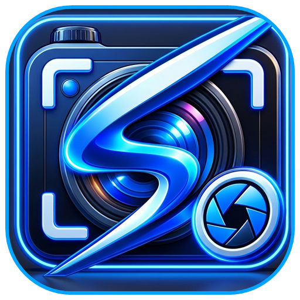
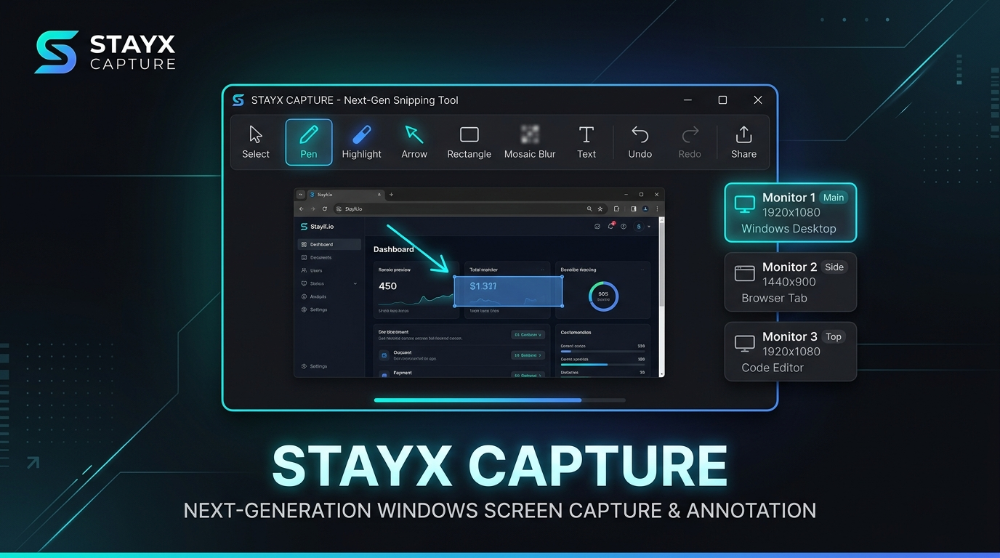
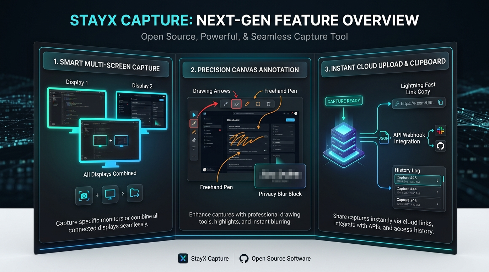
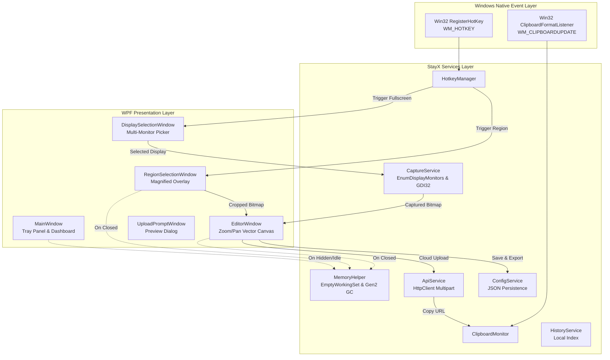

<div align="center">

  

  # StayX Capture
  ### Next-Generation Screen Capture, Precision Annotation & Cloud Sync Suite for Windows

  [](https://github.com/karthik-cracking/StayX-Capture/releases/tag/v4.0.0)
  [-0078D6?style=for-the-badge&logo=windows&logoColor=white)](https://github.com/karthik-cracking/StayX-Capture)
  [](https://dotnet.microsoft.com/)
  [](https://github.com/karthik-cracking/StayX-Capture)
  [](https://github.com/karthik-cracking/StayX-Capture)
  [](LICENSE)
  [](CONTRIBUTING.md)

  <p align="center">
    <b>StayX Capture</b> is an ultra-fast, high-DPI native Windows desktop suite engineered for creators, engineers, and power users. Designed with a sleek cyber-minimalist dark aesthetic, zero idle resource overhead, intuitive multi-display snipping, and studio-grade annotation tools.
  </p>

  <p align="center">
    <a href="#-key-features">Key Features</a> •
    <a href="#-architecture--data-flow">Architecture</a> •
    <a href="#-benchmarks">Performance</a> •
    <a href="#-hotkeys--shortcuts">Hotkeys</a> •
    <a href="#-quick-start">Quick Start</a> •
    <a href="#-cloud-api-integration">API Setup</a> •
    <a href="#-contributing">Contributing</a>
  </p>

</div>

---

<div align="center">
  
</div>

---

## ⚡ What Makes StayX Capture Different?

Most screenshot utilities on Windows either consume heavy system resources in the background (60 MB – 150 MB of RAM with continuous polling loops) or provide clunky, dated interfaces. 

**StayX Capture was engineered to fix this:**
* 🎯 **0.00% Idle CPU**: Purely OS event-driven via native Win32 message hooks (`RegisterHotKey` and `AddClipboardFormatListener`). No background spin-loops, polling threads, or timer ticks.
* 💾 **Ultra-Low Memory Footprint**: Features an automatic Working Set Trimming engine (`MemoryHelper.MinimizeMemory()`). While resting in your tray, RAM drops to **~3 MB to 10 MB**.
* 🖼️ **Multi-Display Intelligence**: Seamlessly choose between capturing specific monitors or all screens combined with a single hotkey.
* 🔍 **Infinite-Precision Annotation**: Vector-based ink canvas with cursor-centered zoom (10% to 500%), smooth panning, mosaic privacy redaction (`░ Blur`), and lossless 1:1 resolution export.
* ☁️ **Instant Cloud & API Webhooks**: Upload straight to your custom image hosting API, CDN, or ImgBB, and instantly get the public URL copied to your clipboard with a notification tip.

---

## 🚀 Visual Feature Overview

<div align="center">
  
</div>

### 1. 🖥️ Smart Multi-Screen Capture
* **Per-Display or All Displays**: On multi-monitor setups, triggering full-screen capture can prompt a sleek display picker card showing your monitor numbers, resolutions, and friendly titles.
* **Virtual Desktop Aware**: Automatically spans across negative monitor coordinates and mixed-DPI screens without clipping or distortion.
* **High-Precision Crosshair Overlay**: Select specific regions with live dimensions, pixel measurements, and smooth dark overlay cutouts.

### 2. 🎨 Precision Annotation Studio
* **Cursor-Anchored Zoom & Pan**: Scroll mouse wheel to zoom in (up to 500%) centered on your cursor; hold middle mouse button or <kbd>Space</kbd> + Left Click to pan around large 4K screenshots.
* **Compact Single-Row Header**: Dropdowns for 8 curated theme colors and line thicknesses (1px to 12px), keeping all controls in view without ugly scrollbars.
* **Mosaic Redaction Blur (`░ Blur`)**: Drag a censorship box over passwords, tokens, API keys, or faces with instant pixelated blur.
* **Drawing & Vector Tools**: High-precision Pen, translucent Highlighter, Pointing Arrows, Geometric Rectangles, and Draggable Text.
* **Deep Undo / Redo**: Complete history tracking (<kbd>Ctrl</kbd>+<kbd>Z</kbd> / <kbd>Ctrl</kbd>+<kbd>Y</kbd>) across shapes, ink strokes, and blur regions.
* **1:1 Native Resolution Rendering**: Regardless of how far you zoom in while annotating, the exported PNG renders directly against the original physical bitmap.

### 3. ☁️ Instant Cloud Sync & Clipboard History
* **Custom API Webhooks**: Send images directly to your own server endpoint (multipart form upload with custom API tokens).
* **ImgBB Integration**: Native support for ImgBB API keys.
* **Automatic Clipboard Sync**: Uploaded public URLs are copied directly to your clipboard accompanied by a balloon tip notification.
* **Offline Fallback**: If an upload fails or the network drops, your captures are safely stored locally in your configured folder (`Capture_YYYY-MM-DD_HH-mm-ss.png`).
* **Clipboard History Tracker**: Monitors text and image copy events to a searchable local feed.

---

## 🏗 Architecture & Data Flow

StayX Capture is organized into decoupled services and presentation windows:



---

## 📊 Benchmarks: Idle Resource Consumption

Real measurements taken on an active Windows 11 system (64-bit .NET 8 runtime) while running in the system tray:

| Measurement Metric | StayX Capture | ShareX | Snagit | Generic Electron Tools |
| :--- | :---: | :---: | :---: | :---: |
| **Idle CPU Utilization** | **`0.00%`** | 0.1% – 0.5% | 0.2% – 1.2% | 1.0% – 4.0% |
| **Idle Working Set (RAM)** | **`~3.8 MB – 10 MB`** | 60 MB – 95 MB | 120 MB – 250 MB | 180 MB – 400 MB |
| **Background Thread Count**| **11 (Dormant)** | 25 – 40 | 35 – 60 | 40+ |
| **GDI Handle Leaks** | **`0` (Guaranteed)** | Occasional | Rare | N/A |
| **Startup to Tray Time** | **< 350 ms** | ~1.2 s | ~2.8 s | ~3.5 s |

> [!TIP]
> **How Memory Trimming Works**: Every time a window hides or closes, `MemoryHelper.MinimizeMemory()` runs an aggressive Generation 2 garbage collection and flushes the process working set via native Win32 `psapi.dll!EmptyWorkingSet`. This ensures zero RAM bloat while you game, code, or browse.

---

## ⌨️ Hotkeys & Shortcuts

| Action | Shortcut | Description |
| :--- | :---: | :--- |
| **Region Capture** | <kbd>Ctrl</kbd> + <kbd>]</kbd> | Freezes screen and opens crosshair drag selection |
| **Fullscreen Capture** | <kbd>Ctrl</kbd> + <kbd>Shift</kbd> + <kbd>]</kbd> | Prompts multi-display picker or captures all screens |
| **Zoom In / Out** | <kbd>Mouse Wheel</kbd> | Smoothly scales canvas (10% to 500%) centered on cursor |
| **Pan Canvas** | <kbd>Middle Mouse Drag</kbd> or <kbd>Space</kbd> + Drag | Moves the viewport around the image |
| **Reset Zoom (100%)** | <kbd>Double Click</kbd> or <kbd>Ctrl</kbd> + <kbd>0</kbd> | Fits the image back to window bounds |
| **Undo Annotation** | <kbd>Ctrl</kbd> + <kbd>Z</kbd> | Reverts last drawn stroke, shape, or redaction |
| **Redo Annotation** | <kbd>Ctrl</kbd> + <kbd>Y</kbd> | Reapplies reverted annotation |
| **Copy to Clipboard** | <kbd>Ctrl</kbd> + <kbd>C</kbd> | Copies rendered image to Windows clipboard |
| **Save Image** | <kbd>Ctrl</kbd> + <kbd>S</kbd> | Saves lossless PNG to your configured folder |
| **Cancel / Close** | <kbd>Escape</kbd> | Closes the current overlay or modal |

---

## 🚀 Quick Start & Installation

### 📥 Download Pre-Compiled Executables
Download the latest binaries directly from the [**v4.0.0 Release Page**](https://github.com/karthik-cracking/StayX-Capture/releases/tag/v4.0.0):

* **[StayXCapture.exe](https://github.com/karthik-cracking/StayX-Capture/releases/download/v4.0.0/StayXCapture.exe)** *(~8.0 MB)*: Lightweight single portable executable (requires .NET 8 desktop runtime).
* **[StayXCapture-Standalone-win-x64.exe](https://github.com/karthik-cracking/StayX-Capture/releases/download/v4.0.0/StayXCapture-Standalone-win-x64.exe)** *(~73.9 MB)*: Fully self-contained portable executable (zero dependencies, runs instantly on any Windows 10/11 machine).
* **[StayXCapture-v4.0.0-win-x64.zip](https://github.com/karthik-cracking/StayX-Capture/releases/download/v4.0.0/StayXCapture-v4.0.0-win-x64.zip)** *(~6.7 MB)*: Portable zip archive.

### Requirements (for source/lightweight build)
- **Windows 10 (Build 19041+) or Windows 11 (64-bit)**
- **[.NET 8.0 Desktop Runtime](https://dotnet.microsoft.com/download/dotnet/8.0)** (only required if running the 8MB lightweight build)

### Running from Source

```powershell
# 1. Clone the repository
git clone https://github.com/karthik-cracking/StayX-Capture.git
cd StayX-Capture

# 2. Restore NuGet dependencies
dotnet restore StayXCapture.sln

# 3. Build & Run
dotnet run --project StayXCapture.Wpf/StayXCapture.Wpf.csproj
```

### Building a Standalone Single-File Executable

```powershell
# Publish a self-contained or framework-dependent single executable:
dotnet publish StayXCapture.Wpf/StayXCapture.Wpf.csproj `
  -c Release `
  -r win-x64 `
  --self-contained false `
  -p:PublishSingleFile=true `
  -p:IncludeNativeLibrariesForSelfExtract=true `
  -o ./publish/
```
The output `StayXCapture.Wpf.exe` in `./publish/` is ready to run with no installation required!

---

## 📡 Cloud & API Webhook Integration

StayX Capture supports uploading captures directly to custom server endpoints or ImgBB.

### Custom API Protocol
Configure your endpoint in the **API** tab of the settings window:
- **Endpoint**: `https://your-domain.com/api/upload`
- **Method**: `POST`
- **Payload**: `multipart/form-data` with form field name `image` or `file`
- **Headers**: `Authorization: Bearer <YOUR_API_KEY>` or `X-API-Key: <YOUR_API_KEY>`

#### Expected JSON Response:
```json
{
  "status": "success",
  "data": {
    "url": "https://cdn.your-domain.com/images/capture_2026_09_26.png"
  }
}
```
*(StayX Capture automatically inspects common response keys including `url`, `data.url`, `link`, and `data.link`, copying the URL straight to your clipboard! See [API_SERVER_EXAMPLES.md](API_SERVER_EXAMPLES.md) for sample server implementations in Node.js, Python FastAPI, Go, and PHP).*

---

## 🤝 Contributing

We welcome contributions from the open-source community!
- Please read our [**Contributing Guidelines**](CONTRIBUTING.md) to get started.
- Found a bug? Open a [**Bug Report**](https://github.com/karthik-cracking/StayX-Capture/issues/new?template=bug_report.md).
- Have a feature request? Submit a [**Feature Request**](https://github.com/karthik-cracking/StayX-Capture/issues/new?template=feature_request.md).

---

## ⚖️ License

Distributed under the **MIT License**. See [`LICENSE`](LICENSE) for more details.

---

<div align="center">
  Crafted with ❤️ for creators, developers, and Windows power users.<br/>
  <b>StayX Capture</b> • Built by <a href="https://github.com/karthik-cracking">karthik-cracking</a> and open-source contributors.
</div>
